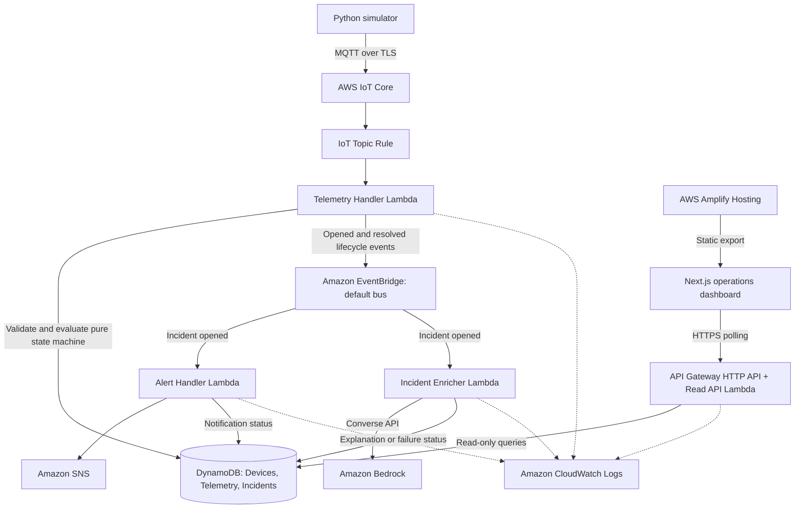

# FreshGuard

**Deterministic cold-room monitoring with event-driven incident response and optional AI enrichment on AWS.**

AWS · TypeScript · Node.js 22 Lambda runtime · Next.js · Python · AWS SAM

[Open the dashboard preview](https://feat-ui-redesign.dyub6sw8bhej6.amplifyapp.com/) · [Architecture](#architecture) · [Get started](#getting-started) · [Run the demo](#run-the-demo) · [Tests](#tests-and-validation) · [Project docs](docs/README.md)

## Overview

Raw temperature readings do not tell an operator whether an excursion has persisted long enough to require attention, which observations accompanied it, or when it recovered. FreshGuard turns simulated cold-room telemetry into a durable incident workflow: detect a sustained configured breach, open one incident, notify an operator, retain evidence, and resolve that incident after sustained recovery.

The detection engine is ordinary, deterministic code. Amazon Bedrock runs independently to summarize recorded evidence; it does not decide whether an incident exists, participate in threshold detection, block alerting, or control recovery.

Built for a four-day AWS hackathon, the prototype focuses on one demo device and a complete incident lifecycle. It detects configured temperature excursions—not food safety, spoilage, or equipment diagnoses.

## Demo / live application

**[FreshGuard dashboard — redesign preview](https://feat-ui-redesign.dyub6sw8bhej6.amplifyapp.com/)**

- Demo device: `cold-room-01` / **Cold Room 01**.
- Hosted on AWS Amplify. This is the supplied branch-preview deployment, not a claimed main-branch production URL.
- The dashboard shows current conditions, a recent temperature chart, active incident evidence, notification status, incident history, and a secondary AI explanation panel.
- Readings change when the simulator is publishing. A **stale** indicator is expected when it stops; viewing the dashboard does not start the simulator.

> **Bedrock runtime status:** The enrichment path is implemented, deployed, and failure-tested. In the team's final AWS testing, EventBridge invoked the Incident Enricher and enrichment processing started, but Bedrock Runtime remained blocked by account verification / service-access restrictions. Two direct `ON_DEMAND` models were tested; observed errors included verification pending and `ValidationException: Operation not allowed`. The deployed demo demonstrated `FAILED` enrichment while incident persistence, SNS notification, API/dashboard access, and recovery continued normally. Successful live model generation is not claimed.

## What FreshGuard demonstrates

| Engineering idea | Implemented behavior |
| --- | --- |
| IoT ingestion | A Python simulator publishes versioned JSON over MQTT/TLS; an IoT Topic Rule routes it to Lambda. |
| Deterministic detection | A pure TypeScript state machine applies configured thresholds and breach/recovery grace periods using observation timestamps. |
| Atomic incident lifecycle | DynamoDB transactions keep device state and incident opening, updates, and resolution consistent. |
| Retry-aware processing | Conditional telemetry storage, device versions, and event-dispatch markers support duplicate and interrupted processing. |
| Independent consumers | EventBridge fans out incident-open events to SNS alerting and Bedrock enrichment separately. |
| Failure isolation | AI failure changes enrichment status, not incident evidence, notification decisions, or recovery logic. |
| Operational visibility | Structured Lambda logs include operation/result and relevant device, event, incident, or request identifiers. |
| Operations dashboard | A responsive, read-only Next.js UI separates monitoring state from freshness and optional AI status. |

## Architecture



The deployment source is [`infrastructure/template.yaml`](infrastructure/template.yaml). It defines four Node.js 22 Lambdas, three on-demand DynamoDB tables, the IoT routing rule and invocation permission, an SNS topic, two incident-open EventBridge consumer rules, an HTTP API, scoped IAM roles, and log groups with seven-day retention.

Both `freshguard.incident.opened` and `freshguard.incident.resolved` are published with source `freshguard.incidents`. The configured alert and enrichment consumers subscribe to **opened** events only; there is no resolution notification or second AI explanation on recovery.

Amplify hosting, the IoT Thing/certificate/policy attachments, and the confirmed SNS email subscription require setup outside this SAM template. [`amplify.yml`](amplify.yml) supplies the frontend build configuration.

### Monitoring state and incident lifecycle

```mermaid
stateDiagram-v2
    [*] --> NORMAL
    NORMAL --> WATCHING: Temperature exceeds maximum
    WATCHING --> NORMAL: Temperature returns to or below maximum
    WATCHING --> ACTIVE: Breach grace satisfied; open incident
    ACTIVE --> ACTIVE: High readings update same incident
    ACTIVE --> RECOVERING: Temperature returns to or below maximum
    RECOVERING --> ACTIVE: Temperature rebounds; keep same incident
    RECOVERING --> NORMAL: Recovery grace satisfied; resolve incident
```



| Monitoring state | Dashboard label | Meaning |
| --- | --- | --- |
| `NORMAL` | Healthy | No active sustained excursion. |
| `WATCHING` | Watching | A breach is being observed during the grace period. |
| `ACTIVE` | Incident | One incident is open for this excursion. |
| `RECOVERING` | Recovering | The same incident remains open while recovery is observed. |

The incident lifecycle is **`OPEN → RESOLVED`**. A reading equal to the configured maximum is not a breach. State transitions occur on accepted readings; there is no background timer that resolves an incident without more telemetry. Door, power, and humidity are context, not independent incident triggers.

The dashboard derives freshness from the latest observation time and `staleAfterSeconds`. **Stale is a separate UI warning, not a fifth monitoring state or an offline incident.**

### Persistence and retry semantics

| Table | Key / index | Purpose |
| --- | --- | --- |
| `FreshGuardDevices-{stage}` | `deviceId` | Configuration, latest telemetry, monitoring state, active incident pointer, and optimistic-concurrency version. |
| `FreshGuardTelemetry-{stage}` | `deviceId` + `sampleKey` | Samples keyed by `"{observedAt}#{eventId}"`; TTL is seven days from receipt. |
| `FreshGuardIncidents-{stage}` | `incidentId`; `ByDeviceOpenedAt` index | Opening evidence, latest/peak temperature, resolution, notification status, and AI enrichment. |

- **Telemetry storage is idempotent.** A repeated sample key does not create another record. A duplicate storage result still permits unfinished device processing to resume; `latest.eventId` identifies a fully processed retry.
- **Old observations do not rewind state.** They can remain in history, but observations older than `lastProcessedAt` cannot advance the device or incident.
- **Lifecycle mutations are atomic.** Device and incident changes share a transaction. The same open incident receives updates during `ACTIVE` and `RECOVERING`; resolution stores the resolving reading and retains its historical peak. Peak tracking starts when the incident opens.
- **Concurrency is conditional.** Device updates require the version that was read, with up to three fresh-read/update attempts and no unconditional fallback.
- **Event publication is recoverable, not exactly once.** Persisted pending/sent markers allow telemetry retries to reconcile lifecycle events, including resolution after the active pointer is cleared.
- **SNS delivery is also at least once.** A conditional claim and 60-second lease prevent normal concurrent duplicate sends. A crash after SNS accepts a message but before `SENT` is stored can still cause a repeat notification.

Telemetry storage is separate from device processing. Recovery from an interrupted attempt depends on redelivery; there is no background repair worker. See the [Telemetry Handler](services/telemetry-handler/README.md) and [Alert Handler](services/alert-handler/README.md) notes for the remaining delivery windows.

### AI enrichment boundary

The Incident Enricher loads persisted evidence and conditionally claims an incident before calling Bedrock's Converse API. The prompt includes the threshold, opening/peak temperatures, breach timing, and observed door/power states. It requests a short explanation grounded in those observations, without asserting causation, spoilage, or food-safety certification.

| AI state | Meaning in the dashboard |
| --- | --- |
| `PENDING` | Queued for enrichment. |
| `GENERATING` | The worker has claimed enrichment processing. |
| `READY` | Explanation text is available. The automated success tests use mocked Bedrock responses. |
| `FAILED` | Explanation unavailable; deterministic evidence remains usable. |

Bedrock is called for incident enrichment, never per telemetry sample. `FAILED` is terminal in this implementation, and `GENERATING` has no expired-claim recovery policy. A hard worker interruption or failed status write may therefore need manual investigation. The [worker](services/incident-enricher/src/index.ts), [prompt](services/incident-enricher/src/prompt.ts), and [failure-isolation tests](services/incident-enricher/src/index.test.ts) make this boundary reviewable.

## Repository map

```text
apps/web/                    Next.js dashboard, API client, responsive UI
packages/contracts/          Telemetry types and runtime validation
packages/domain/             Pure monitoring state machine and tests
services/telemetry-handler/   Validation, persistence, lifecycle, event publication
services/alert-handler/       Incident-open SNS notifications
services/incident-enricher/   Asynchronous Bedrock enrichment
services/read-api/            Public read-only HTTP routes and DTO mappings
simulator/                   Python publishers, scenarios, and pytest tests
infrastructure/              Current SAM template and deployment configuration
scripts/                     Create-only device seed and scoped IoT policy template
docs/                        Design documents, runbooks, and demo guidance
amplify.yml                  Frontend static-export build configuration
```

`backend/` contains a separate Python prototype; it is not the backend deployed by the current `infrastructure/template.yaml`. Some early design/runbook sections describe planned milestones. The service implementation, current SAM template, and commands below describe the submission code.

## Getting started

### Prerequisites

- Git, Node.js **22.18+** (or a newer compatible release), and **pnpm 12.4.2**, as pinned in `package.json`.
- Python **3.12+** for the simulator.
- AWS CLI v2, AWS SAM CLI, and a configured AWS development identity for deployment.
- An AWS IoT certificate identity for live MQTT publishing. Local TypeScript tests do not require AWS credentials.
- Bedrock model access in the selected region for successful live enrichment; the core incident/notification path does not require generation to succeed.

The checked-in SAM configuration defaults to `ap-south-1`, stack `freshguard-dev`, and stage `dev`. Review these values for your account. Lambda bundles are built with esbuild before SAM packaging; Docker is not required by this build workflow.

```sh
git clone https://github.com/AwesomeWiz/FreshGuard.git
cd FreshGuard
pnpm install --frozen-lockfile
```

### Run the dashboard locally

Copy [`apps/web/.env.example`](apps/web/.env.example) to `apps/web/.env.local` and set:

```dotenv
NEXT_PUBLIC_API_BASE_URL=https://YOUR_API_ID.execute-api.YOUR_REGION.amazonaws.com/dev
NEXT_PUBLIC_DEMO_DEVICE_ID=cold-room-01
```

Use the deployed stack's **`ReadApiUrl`** output, including its stage, as the API base URL. These are public client settings, not credentials. Allow `http://localhost:3000` in the backend's `AllowedWebOrigins` parameter.

```sh
pnpm --filter @freshguard/web dev
```

Open `http://localhost:3000`. The UI uses the real read API; a missing base URL does not activate a mock backend. Publish at least one valid reading after seeding before opening the dashboard: the API can return `latest: null` for a newly seeded device, while the current dashboard assumes a latest reading exists.

Device and active-incident polling repeats 2.5 seconds after each cycle; telemetry and history polling repeat after 4 seconds. Refresh failures preserve previously loaded values and expose a retry control.

### Build and deploy the backend

From the repository root, build **all four** service bundles before packaging:

```sh
pnpm --filter @freshguard/telemetry-handler build
pnpm --filter @freshguard/alert-handler build
pnpm --filter @freshguard/incident-enricher build
pnpm --filter @freshguard/read-api build
sam validate --template-file infrastructure/template.yaml
sam build --template-file infrastructure/template.yaml
```

The template uses `SkipBuild: true` and packages each service's existing `dist/` bundle. Rebuild those bundles after changing service code. If basic validation needs AWS identity/region, the existing runbook also provides `sam validate --lint --template-file infrastructure/template.yaml` for local linting.

To deploy to your own account, review the IAM/resources and run:

```sh
sam deploy --guided --template-file .aws-sam/build/template.yaml --region ap-south-1
```

Configure these template parameters in the guided flow:

| Parameter | Value to supply |
| --- | --- |
| `Stage` | `dev` for the checked-in demo seed/policy. |
| `AllowedWebOrigins` | Exact allowed browser origins, comma-separated: localhost and your Amplify origin, without trailing slashes. |
| `BedrockModelId` | A direct foundation-model ID supporting Converse in your region; the IAM policy is scoped to that model. |

`BedrockModelId` has no default and is absent from the checked-in `samconfig.toml` parameter overrides. Supply it explicitly; do not assume saved Day-1 deployment settings include all current parameters. Account-level Bedrock access must be checked separately from successful stack deployment.

SAM provides Lambda environment variables for stage, table names, SNS topic, notification lease, incident index, allowed origins, and Bedrock model ID. Do not put AWS credentials in source files or frontend variables.

After deployment:

1. Seed `cold-room-01` with [`scripts/seed-demo-device.ps1`](scripts/seed-demo-device.ps1). From PowerShell, preview with `./scripts/seed-demo-device.ps1 -Region ap-south-1 -DryRun`, then omit `-DryRun` to create it. The seed is create-only and does not reset existing state.
2. Follow the [IoT provisioning runbook](docs/21_DAY1_IOT_DEPLOYMENT.md) for the Thing, certificate, policy, attachments, and ATS endpoint. Its old single-handler build instructions are superseded by the four builds above.
3. Subscribe a team-controlled email endpoint to the **`IncidentAlertsTopicArn`** output and confirm the SNS subscription email.
4. Use **`ReadApiUrl`** for local/Amplify frontend configuration, publish a first reading, and verify `/health` and `/devices/cold-room-01`.

### Deploy the dashboard with Amplify

Connect the repository/desired branch in Amplify Hosting and use [`amplify.yml`](amplify.yml). It installs workspace dependencies, builds `apps/web`, and publishes **`apps/web/out`**. [`next.config.mjs`](apps/web/next.config.mjs) uses `output: 'export'`; the deployment is a static frontend, not a Next.js server.

Set `NEXT_PUBLIC_API_BASE_URL` and `NEXT_PUBLIC_DEMO_DEVICE_ID` in Amplify **before building**. Changes to these public settings require a rebuild. Add the exact Amplify origin to `AllowedWebOrigins` on the backend, then verify API requests, polling, and stale/AI states in the deployed page.

## Run the demo

### Simulator setup

From the repository root:

```sh
cd simulator
python -m venv .venv
```

Activate with `.venv\Scripts\Activate.ps1` on Windows PowerShell or `source .venv/bin/activate` on macOS/Linux, then install:

```sh
python -m pip install -r requirements.txt
python -m pip install awsiotsdk
```

**Current packaging caveat:** `requirements.txt` contains the older `AWSIoTPythonSDK`, while the module publisher imports `awsiot`/`awscrt` from [AWS IoT Device SDK for Python v2](https://github.com/aws/aws-iot-device-sdk-python-v2#installation). The second install is needed for the module commands below, including dry-run. It is not yet pinned in the repository's requirements file.

Copy `simulator/.env.example` to `simulator/.env`. When running **from `simulator/`**, use this configuration with your endpoint:

```dotenv
AWS_IOT_ENDPOINT=YOUR_IOT_ATS_ENDPOINT.amazonaws.com
AWS_IOT_CLIENT_ID=freshguard-simulator-cold-room-01
AWS_IOT_TOPIC=freshguard/dev/devices/cold-room-01/telemetry
AWS_IOT_CERT_PATH=../.simulator-certs/device.pem.crt
AWS_IOT_PRIVATE_KEY_PATH=../.simulator-certs/private.pem.key
AWS_IOT_ROOT_CA_PATH=../.simulator-certs/AmazonRootCA1.pem
DEVICE_ID=cold-room-01
TICK_SECONDS=2
```

The client ID above matches [`scripts/iot-demo-policy.json`](scripts/iot-demo-policy.json); the `FreshGuardSimulator` value in the example file does not match that scoped policy. Certificate paths are relative to the working directory. Keep keys and certificates local under the ignored `.simulator-certs/` directory.

### Scenarios and expected results

Run these from `simulator/` with the virtual environment active:

```sh
# Inspect generated telemetry without an AWS connection
python -m freshguard_simulator normal --env-file .env --dry-run

# Publish the three stages, one command at a time
python -m freshguard_simulator normal --env-file .env
python -m freshguard_simulator breach-door-open --env-file .env
python -m freshguard_simulator recovery --env-file .env
```

Dry-run still reads the environment file and requires its configuration values, but does not load certificates or connect to AWS. Live publishing uses MQTT QoS 1. Each scenario is finite and exits after its final reading.

| Scenario | What to observe |
| --- | --- |
| `normal` | Temperatures around 4–5°C, door closed, power on, and `NORMAL` / Healthy when starting without an active incident. |
| `breach-door-open` | Rising temperatures and an observed open door; `WATCHING`, then `ACTIVE` with one `OPEN` incident, SNS notification, and independent AI processing. |
| `recovery` | Readings return below the threshold; `RECOVERING`, then `NORMAL`, with the same incident `RESOLVED` and its duration/peak retained. |

The checked-in seed uses **8°C maximum, 20s breach grace, 15s recovery grace, and 20s stale timing**. These are demo parameters, not universal safety limits. At the default two-second interval, the breach and recovery scenarios span the seeded grace periods. `--tick-seconds` can override timing, but shortening it can prevent those periods from being satisfied.

Use the module entry point above for the lifecycle demo. The alternative `python mqtt_simulator.py --scenario breach-door-open` script pre-generates observation timestamps before its publishing loop and can fall back to local-only printing on connection failure. Its output alone does not demonstrate ingestion or correctly timed grace transitions.

Before recording, confirm the SNS subscription, start with no active incident, and keep the dashboard and relevant CloudWatch logs visible. In the current account, show the calm AI-unavailable state alongside intact incident evidence rather than presenting a mocked explanation as live Bedrock output. Stopping the simulator should eventually display the separate stale warning.

## Telemetry contract

Demo topic: `freshguard/dev/devices/cold-room-01/telemetry`.

```json
{
  "schemaVersion": 1,
  "eventId": "d9e59782-20bc-4a80-ae2a-237bc5cf55af",
  "deviceId": "cold-room-01",
  "observedAt": "2026-09-20T10:00:00.000Z",
  "temperatureC": 9.4,
  "humidityPct": 66,
  "doorState": "OPEN",
  "powerState": "ON"
}
```

`schemaVersion`, `eventId`, `deviceId`, `observedAt`, and `temperatureC` are required. **Humidity, door, and power are optional.** Validation rejects unsupported versions, invalid identifiers/timestamps, non-finite numbers, temperatures outside the technical `-100..200` range, humidity outside `0..100`, and unsupported contextual enums. The technical range is separate from the device's breach threshold.

The simulator generates fresh event IDs and UTC observation timestamps. Replaying an identical payload tests deduplication; changing its observation time changes its storage key. See [shared validation](packages/contracts/telemetry.ts) and [event/API contracts](docs/06_EVENT_AND_API_CONTRACTS.md).

## Read-only HTTP API

All routes are relative to the stack's `ReadApiUrl` output. The API is public and read-only; it does not expose telemetry ingestion, configuration changes, incident resolution, or model invocation.

| Method | Route | Behavior |
| --- | --- | --- |
| `GET` | `/health` | Returns `{ "status": "ok", "service": "freshguard-api" }`; not a dependency health check. |
| `GET` | `/devices` | Device summaries from a bounded scan of up to 50 items. |
| `GET` | `/devices/{deviceId}` | Configuration, monitoring/presentation states, latest telemetry, and active incident ID. |
| `GET` | `/devices/{deviceId}/telemetry?minutes=30&limit=300` | Recent samples returned chronologically. Minutes: 1–1,440; limit: 1–300. |
| `GET` | `/devices/{deviceId}/incidents?limit=10` | Incident history, newest first; limit: 1–50. |
| `GET` | `/incidents/{incidentId}` | Deterministic evidence, lifecycle, notification, and AI fields. |

The values shown in the query examples are the defaults. Invalid bounds return `400 INVALID_QUERY`; missing resources return controlled `404` responses. Errors use an `error` object with `code`, `message`, and `requestId`, without exposing raw AWS errors. Internal version, claim, and event-dispatch metadata are omitted from response DTOs. No public pagination cursor is implemented.

## Tests and validation

From the repository root:

```sh
pnpm -r --if-present test
pnpm -r --if-present typecheck
pnpm --filter @freshguard/web exec tsc --noEmit
pnpm --filter @freshguard/web build
node apps/web/__tests__/ai-enrichment.test.ts
```

Use the recursive test command above: root `pnpm test` is still a placeholder. The domain package does not define a `typecheck` script; the recursive command runs only configured scripts. The web package is checked separately and during its build.

The current Vitest suites contain **220 passing tests** across six packages:

| Suite | Tests | Main coverage |
| --- | ---: | --- |
| Domain | 12 | State transitions, grace boundaries, equality, and old observations. |
| Contracts | 89 | Required/optional fields, identifiers, UTC dates, enums, and numeric bounds. |
| Telemetry Handler | 46 | Partial-processing retries, optimistic concurrency, atomic lifecycle, recovery temperatures, and recoverable event dispatch. |
| Alert Handler | 15 | Claims, duplicate delivery, lease recovery, SNS failure, and status persistence. |
| Incident Enricher | 20 | Evidence-only prompts, mocked model success/failure, duplicate claims, and lifecycle isolation. |
| Read API | 38 | Routes, DTOs, query bounds, CORS, and safe errors. |

The standalone frontend script has **12 passing logic checks** for AI states and evidence coexistence. It is not a browser-rendering or end-to-end test suite. AWS clients in service tests are injected mocks; these tests do not establish live IoT/SNS/Bedrock availability.

Simulator tests run separately, from `simulator/` with its environment activated:

```sh
python -m pytest tests
```

They cover payload construction and scenario values/timing expectations. Deployed smoke testing remains separate: publish via MQTT, inspect persisted device/incident records, confirm SNS receipt, verify the API/dashboard, and run recovery. The Bedrock runtime note above records the team's final AWS failure-isolation result, not a mocked generation success.

## Security, observability, and cost choices

- **Scoped service roles:** the Read API has DynamoDB read permissions only; alerting can publish only to its configured SNS topic; enrichment can invoke only the configured foundation-model ARN. Lambda invocation permissions are restricted to the relevant rule/account.
- **Public prototype boundary:** there is no authentication, authorization layer, or multi-tenancy. CORS limits browser origins; it is not access control for public data. The browser receives API configuration, not AWS credentials.
- **Local device identity:** the demo IoT policy permits only its named MQTT client and telemetry topic. Certificates, private keys, and `.env` values stay outside version control.
- **Structured logs:** telemetry, lifecycle dispatch, alert, enrichment, and API operations can be followed through CloudWatch. For the default stage, log groups use `/aws/lambda/freshguard-dev-{service}` with service names `telemetry-handler`, `alert-handler`, `incident-enricher`, and `read-api`.
- **Bounded storage and work:** seven-day telemetry TTL, seven-day log retention, DynamoDB on-demand billing, bounded API queries, and incident-triggered AI calls limit unnecessary work. TTL is an expiry mechanism, not immediate deletion or archival.
- **No invented cost guarantee:** charges depend on traffic, polling, notifications, model use, and hosting. There are no custom CloudWatch alarms, budget resources, or DLQs in the current template. Stop demo publishers and remove unneeded resources after use; IoT identities and Amplify are managed separately from the SAM stack.

## Scope and limitations

- Software-simulated telemetry; no physical sensor integration has been validated.
- One configured dashboard demo device; no fleet management UI or tenant isolation.
- No predictive ML, spoilage prediction, autonomous refrigeration control, or food-safety certification.
- Polling rather than WebSockets; no scheduled offline detector or automatic incident resolution when readings stop.
- At-least-once external delivery and redelivery-dependent repair, not end-to-end exactly-once processing.
- Bedrock runtime access remains account-blocked in the final tested deployment; terminal AI failures and interrupted enrichment have no automatic recovery policy.
- Fresh-clone simulator dependency/client-ID adjustments and the first-reading dashboard prerequisite are documented above. The legacy publisher is not interchangeable with the module demo commands.
- Automated tests are local logic/handler tests. No GitHub Actions workflow is currently checked in, and no CI badge is claimed.

## Further reading

- [Product requirements](docs/01_PRD.md) and [technical design](docs/02_TDD.md)
- [Architecture](docs/03_ARCHITECTURE.md) and [state-machine specification](docs/04_DOMAIN_AND_STATE_MACHINE.md)
- [Data model](docs/05_DATA_MODEL.md) and [event/API contracts](docs/06_EVENT_AND_API_CONTRACTS.md)
- [Reliability](docs/08_RELIABILITY_AND_OBSERVABILITY.md) and [test strategy](docs/09_TEST_STRATEGY.md)
- [IoT setup and seed runbook](docs/21_DAY1_IOT_DEPLOYMENT.md)
- [Demo planning](docs/13_DEMO_AND_SUBMISSION.md) — use the runtime-status note in this README when presenting AI behavior

## AI-assisted development

ChatGPT/Codex assisted with implementation, debugging, tests, UI refinement, and documentation. That development assistance is distinct from the optional Amazon Bedrock enrichment running in the application. The repository's [AI-assisted workflow](docs/16_CODEX_WORKFLOW.md) documents the review process and disclosure guidance.
