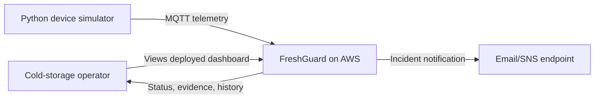
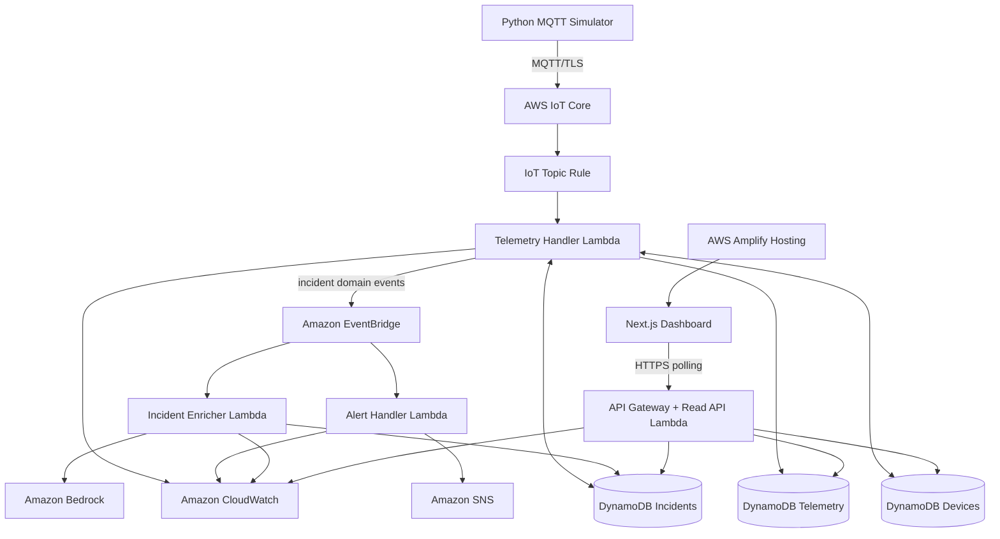
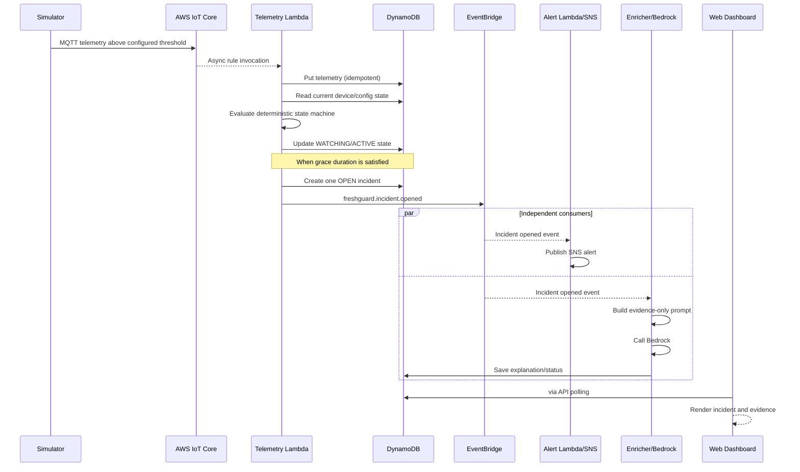
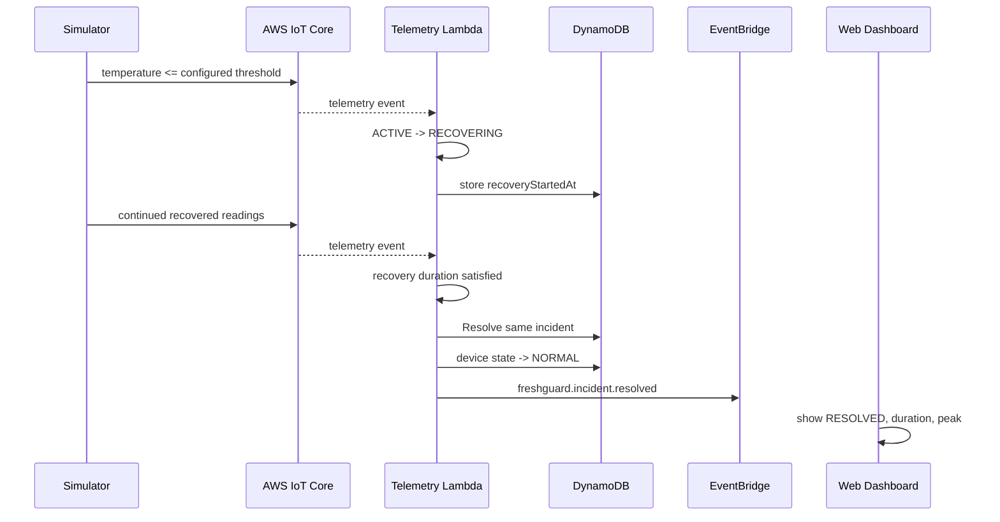
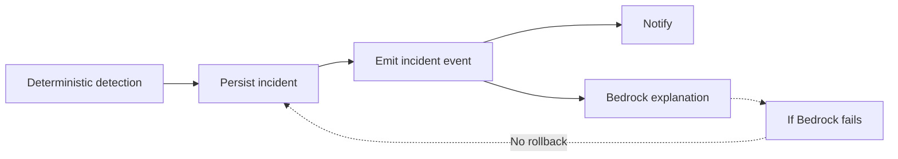

# Architecture

## 1. Architecture objective

FreshGuard should look and behave like a small production event-processing system, not a generic dashboard with an LLM attached.

## 2. System context

## 3. Container/component architecture

## 4. Incident-open sequence

## 5. Recovery sequence

## 6. Failure-isolation architecture

The critical safety/operational path is intentionally separated from AI enrichment:

The desired property is:

> **AI failure degrades explanation quality, not incident correctness.**

## 7. Data ownership

- **Telemetry table** owns immutable/recent sample facts.
- **Devices table** owns mutable current configuration and monitoring state.
- **Incidents table** owns the lifecycle record for each incident.
- **Bedrock output** is stored as enrichment on the incident, never as the source of the incident.

## 8. Trust boundaries

### Device boundary

The simulator possesses its own local certificate/private key and can publish only to the permitted telemetry topic.

### Cloud backend boundary

Lambda roles perform AWS mutations. The browser does not receive AWS credentials.

### Public UI boundary

The deployed dashboard consumes read-only HTTP endpoints. It cannot publish telemetry, edit thresholds, resolve incidents, invoke Bedrock, or publish SNS messages in P0.

## 9. Why each AWS service exists

### AWS IoT Core

Provides MQTT device ingress and routes topic messages into AWS services. It is the production-shaped replacement for writing a custom MQTT broker.

### Lambda

Runs stateless validation, deterministic event processing and API handlers with no always-on server.

### DynamoDB

Stores current device state, recent telemetry and incident lifecycle records with serverless scaling and simple key-based access patterns.

### EventBridge

Decouples the detector from independent incident consumers. Adding another incident consumer later should not require changing the detector contract.

### SNS

Provides a real external notification path visible in the demo.

### Bedrock

Adds grounded natural-language incident explanation from structured evidence. It is deliberately not invoked for every reading.

### API Gateway

Provides an HTTP boundary between the public dashboard and private AWS data services.

### Amplify Hosting

Provides the deployed frontend URL required for the Ship It presentation.

### CloudWatch

Makes the system diagnosable and proves operational awareness in the demo/repository.

### SAM

Keeps architecture reproducible, reviewable and version-controlled.

## 10. Architecture constraints

- No physical hardware is required.
- No long-running EC2 server.
- No autonomous equipment control.
- No client-side AWS secret credentials.
- No Bedrock call in the per-reading path.
- No requirement for WebSockets.
- No manual incident creation in P0.

## 11. Future-production evolution (not P0)

A real deployment might add:

- device fleet provisioning/rotation;
- IoT Device Defender;
- Device Shadow;
- SQS/DLQs between critical consumers;
- stronger exactly-once business semantics using transactions/idempotency store;
- Amazon Timestream or S3 analytics for long telemetry retention;
- Cognito and tenant/site authorization;
- calibrated sensors and gateway connectivity;
- escalation policies;
- audit exports;
- dashboards/alarms for backend SLOs;
- regional resilience.

Do not implement these simply to increase the AWS-service count during the hackathon.
